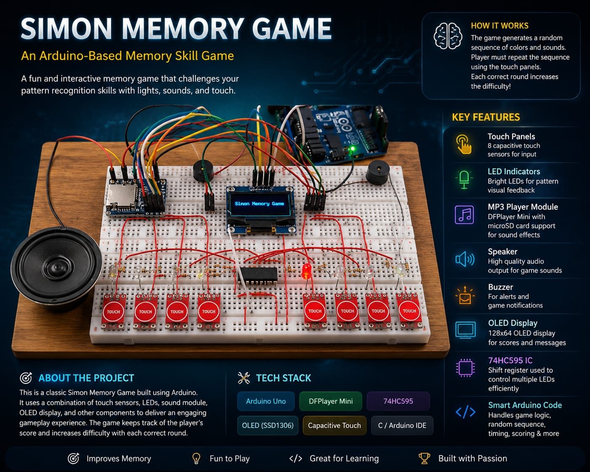
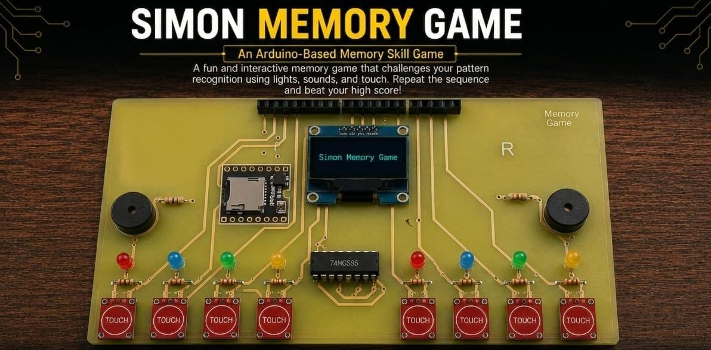
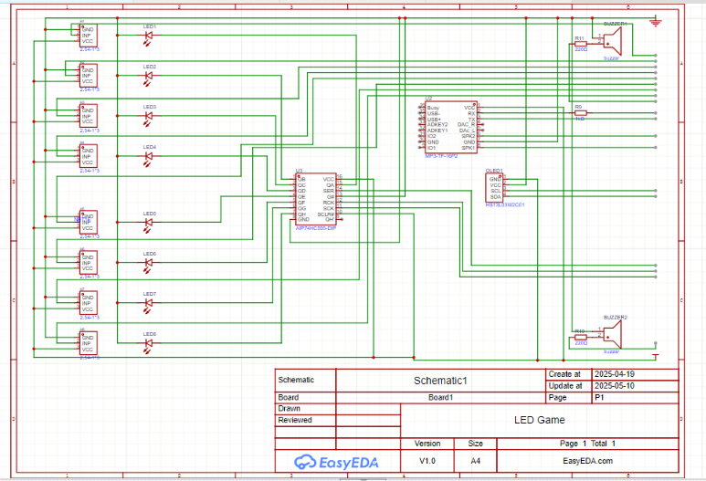
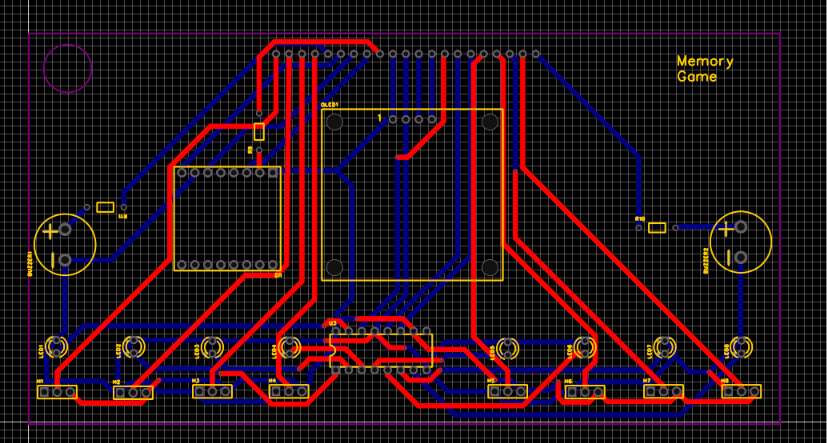
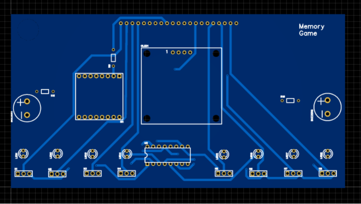
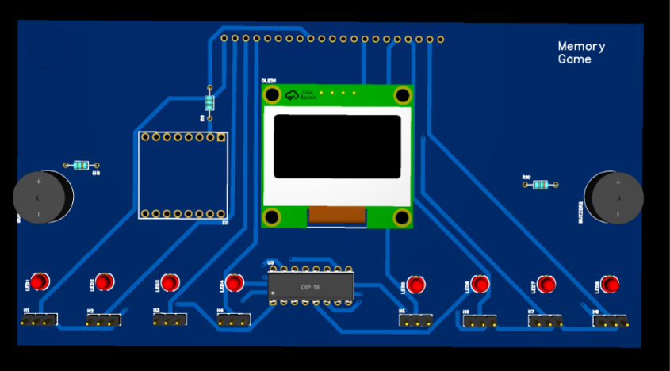

# Arduino-Simon-Memory-Game-Project
# 🎮 Simon Memory Game

An Arduino-based Simon Memory Game featuring a custom-designed PCB, OLED display, capacitive touch sensors, LEDs, audio feedback, and multiple game modes.

> 📌 This project was originally developed during my **2nd semester** as an embedded systems learning project.

---

# 📷 Project Showcase

## Breadboard Prototype

This was the first working prototype before designing the PCB.

---

## Final PCB Design

After successfully testing the circuit on a breadboard, I designed a custom PCB to reduce wiring complexity and make the project more compact.

---

## PCB Design (EasyEDA)

### Schematic

---

### PCB Layout

---

### 2D PCB

---

### 3D PCB

---

# ✨ Features

- Single Player Mode
- Two Player Mode
- High Score Tracking
- Random Pattern Generation
- Increasing Difficulty
- OLED Display Interface
- Audio Feedback
- LED Pattern Display
- Capacitive Touch Controls
- Custom PCB Design

---

# 🧠 How the Game Works

The game generates a random sequence.

The player repeats the sequence using the capacitive touch sensors.

Each successful round increases the sequence length, making the game progressively more difficult.

The OLED displays menus, score, and game information.

LEDs provide visual feedback while buzzers and the speaker produce sound effects.

Both Single Player and Two Player modes are supported.

---

# 🛠 Hardware Used

| Component | Quantity |
|-----------|---------:|
| Arduino Uno | 1 |
| Custom PCB | 1 |
| SSD1306 OLED Display (128×64) | 1 |
| DFPlayer Mini MP3 Module | 1 |
| microSD Card | 1 |
| Speaker | 1 |
| Buzzers | 2 |
| 74HC595 Shift Register | 1 |
| Capacitive Touch Sensor Modules | 8 |
| LEDs | 8 |
| Resistors | Multiple |
| Female Header Connectors | Multiple |
| Jumper Wires | Multiple |

---

# 💻 Software Used

- Arduino IDE
- EasyEDA
- C++
- Embedded Systems Programming

---

# 📚 What I Learned

Through this project I gained practical experience with:

- PCB Design
- Arduino Programming
- Embedded Systems
- Hardware Debugging
- Soldering
- Electronic Circuit Design
- Component Integration
- Problem Solving

---

# 📝 Note

This project was developed during my second semester.

The PCB images included in this repository have been enhanced using AI for presentation purposes. The PCB design, circuit design, hardware implementation, and firmware were created by me. AI was only used to improve the visual quality of the project images.

Unfortunately, the original Arduino source code is no longer available, but the hardware design and project documentation are preserved here.

---

# 🚀 Future Improvements

- Bluetooth Connectivity
- Mobile App Support
- EEPROM Score Storage
- RGB LED Effects
- Better Audio Effects
- Rechargeable Battery Support

---

# 👤 Author

**GhulamMohyUddin**

Computer Science Student

FAST National University
